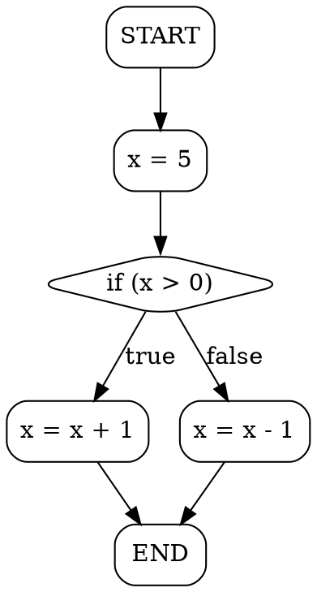

## Control Flow Graph (CFG)

In a compiler, a Control Flow Graph (CFG) is a representation of all
paths that can be traversed through a program during execution.
It's a vital structure used for various compiler optimisations and
analyses, such as dead code elimination, loop unrolling, and more.

A CFG consists of:
- *Nodes (Basic Blocks)*: Sequences of instructions executed sequentially
- *Edges (Control Flow)*: Possible transitions between basic blocks

CFGs are essential for:
- *Program Analysis*: Understanding program behavior
- *Optimisation*: Finding opportunities to improve code
- *Verification*: Proving program properties
- *Debugging*: Visualising execution paths


### Basic Concepts

#### Nodes (Basic Blocks)
A basic block is a sequence of instructions in which the control flow enters
at the beginning and exits at the end. There's no branching except at the end of the block.

*Properties of a basic block:*
- Single entry point (beginning)
- Single exit point (end)
- No internal jumps or branches
- All instructions execute sequentially

#### Edges (Control Flow)
An edge represents a possible jump from one basic block to another. This is usually
caused by control structures like `if`, `while`, `for`, or function calls.

*Types of edges:*
- *Forward edges*: Normal sequential flow
- *Back edges*: Loop iterations (target has lower position than source)
- *Conditional edges*: Branches based on conditions (true/false paths)

### Creating Basic Blocks

To create a basic block:
1. Split the code at each conditional statement, loop, or jump
2. Split at labels or function entry points
3. Each segment between split points becomes a basic block


### Interactive Examples

This package includes several interactive HTML visualisations that you can open in
your browser. Each demonstrates different control flow patterns.


__Example 1: Simple Conditional (if-else)__
*File*: `cfg-if-else.html`

```c
int x = 5;
if (x > 0) {
    x = x + 1;
} else {
    x = x - 1;
}
```

*CFG Structure:*
```
    [Start: x=5]
         |
    [x > 0?] (condition)
      /    \
   true    false
    /        \
[x=x+1]    [x=x-1]
    \        /
      [End]
```

*Key Points:*
- The condition creates two branches
- Both branches merge at the end
- Only one path executes at runtime


__Example 2: Loop (while)__

*File*: `cfg-while-loop.html`

```c
int x = 0;
while (x < 5) {
    x = x + 1;
}
```

*CFG Structure:*
```
  [Start: x=0]
       |
  [x < 5?] <-------+
    /      \       |
  true    false    | (back edge)
   /         \     |
[x=x+1]     [End]  |
   |               |
   +---------------+
```

*Key Points:*
- Back edge from loop body to condition
- Exit edge when condition is false
- Back edges are highlighted in red in the visualization


__Example 3: Nested Conditionals and Loops__

*File*: `cfg-nested.html`

```c
int x = 10;
int y = 5;

while (x > 0) {
    if (y > 0) {
        x = x - 1;
    } else {
        y = y - 1;
    }
}
```

*CFG Structure:*
```
    [Start: x=10, y=5]
          |
       [x > 0?] <----------+
        /     \            |
     true    false         |
      /        \           |
  [y > 0?]    [End]        |
   /    \                  |
true   false               |
 /        \                |
[x=x-1]  [y=y-1]           |
  \        /               |
   +------+                |
      |                    |
      +--------------------+
```

*Key Points:*
- Outer while loop with back edge
- Inner if-else creates additional branches
- Complex control flow with multiple paths


__Example 4: Switch Statement__

*File*: `cfg-switch.html`

```c
int day = 3;
switch (day) {
    case 1:
        print("Monday");
        break;
    case 2:
        print("Tuesday");
        break;
    case 3:
        print("Wednesday");
        break;
    default:
        print("Other");
}
```

*CFG Structure:*
```
    [Start: day=3]
           |
    [switch(day)]
     /   |   |   \
   1/   2|   3|    \default
   /     |    |     \
[Mon] [Tue] [Wed] [Other]
   \     |    |     /
    \    |    |    /
         [End]
```

*Key Points:*
- Multiple outgoing edges from switch node
- Each case is a separate path
- All paths converge at end (with break statements)


### Building CFGs

#### Step-by-Step Implementation

Let's walk through how you might implement a CFG in a compiler.

#### Example: Implementing CFG for a Simple Program

Consider this Fibonacci function:

```c
int fib(int n) {
    if (n <= 1) return n;
    int a = 0, b = 1;
    for (int i = 2; i <= n; i++) {
        int temp = a + b;
        a = b;
        b = temp;
    }
    return b;
}
```

__Step 1: Identify the Basic Blocks__

- *Block 1*: Start of function, includes `if (n <= 1)` check
- *Block 2*: Return statement `return n`
- *Block 3*: Initialize `a` and `b`, for loop condition
- *Block 4*: Body of the for loop
- *Block 5*: Return `b` statement

__Step 2: Identify the Control Flow__

- From entry → Block 1 (checking `n <= 1`)
- If `n <= 1` is true → Block 2 (return n)
- If `n > 1` → Block 3 (initialization and loop)
- Loop condition → Block 4 (loop body) or Block 5 (exit)
- Block 4 → back to loop condition
- After loop → Block 5 (return b)

__Step 3: Implement the CFG in Python__

```python
class CFGNode:
    def __init__(self, block_id, statements):
        self.block_id = block_id
        self.statements = statements
        self.edges = []  # List of nodes this block points to

    def add_edge(self, target_node):
        self.edges.append(target_node)

class ControlFlowGraph:
    def __init__(self):
        self.nodes = {}

    def add_node(self, block_id, statements):
        node = CFGNode(block_id, statements)
        self.nodes[block_id] = node
        return node

    def display(self):
        for block_id, node in self.nodes.items():
            print(f"Block {block_id}:")
            print(f"  Statements: {node.statements}")
            print(f"  Control Flow: {[edge.block_id for edge in node.edges]}")

# Init the CFG
cfg = ControlFlowGraph()

# Add nodes (basic blocks)
block_1 = cfg.add_node(1, ["if (n <= 1)"])
block_2 = cfg.add_node(2, ["return n"])
block_3 = cfg.add_node(3, ["int a = 0, b = 1;", "for (int i = 2; i <= n; i++)"])
block_4 = cfg.add_node(4, ["int temp = a + b;", "a = b;", "b = temp;"])
block_5 = cfg.add_node(5, ["return b;"])

# Add edges (control flow)
block_1.add_edge(block_2)  # if n <= 1
block_1.add_edge(block_3)  # if n > 1
block_3.add_edge(block_4)  # enter loop
block_4.add_edge(block_3)  # loop back
block_3.add_edge(block_5)  # exit loop

# Display the CFG
cfg.display()
```

*Output:*
```
Block 1:
  Statements: ['if (n <= 1)']
  Control Flow: [2, 3]
Block 2:
  Statements: ['return n']
  Control Flow: []
Block 3:
  Statements: ['int a = 0, b = 1;', 'for (int i = 2; i <= n; i++)']
  Control Flow: [4, 5]
Block 4:
  Statements: ['int temp = a + b;', 'a = b;', 'b = temp;']
  Control Flow: [3]
Block 5:
  Statements: ['return b;']
  Control Flow: []
```


### Mini CFG Compiler

This package includes a small C compiler (`mini_cfg_compiler.c`)
that demonstrates CFG construction in practice.

#### Features

The compiler:
- Parses simple C-like programs
- Builds a complete CFG
- Outputs in text and DOT (Graphviz) formats
- Handles if-else, while loops, and assignments

#### Compilation

```bash
gcc -o mini_cfg mini_cfg_compiler.c
```

#### Usage

```bash
## Run with test programs
./mini_cfg < test1_ifelse.c
./mini_cfg < test2_while.c
./mini_cfg < test3_nested.c
```

#### Example Output

For `test1_ifelse.c`:
```c
x = 5;
if (x > 0) {
    x = x + 1;
} else {
    x = x - 1;
}
```

The compiler produces:

*Text Format:*
```
-- Control Flow Graph --

Block 0: START
  Successors: 1

Block 1: x = 5
  Successors: 2

Block 2: if (x > 0)
  Successors: 3 5

Block 3: x = x + 1
  Successors: 6

Block 4: merge
  Successors: 7

Block 5: x = x - 1
  Successors: 6

Block 6: merge
  Successors: 7

Block 7: END
  Successors: (exit)
```

*DOT Format:*


You can visualise the DOT output at: https://dreampuf.github.io/GraphvizOnline/
(which do rendering much better than the html/js we have here).

#### Supported Syntax

```c
// Variable assignments
x = 5;
y = x + 10;

// Conditionals
if (x > 0) {
    statement;
} else {
    statement;
}

// Loops
while (x < 10) {
    statement;
}

// Return
return x;
```

#### How It Works

1. *Lexical Analysis*: Tokenizes the input into keywords, identifiers, operators
2. *Parsing*: Recognizes control structures and statements
3. *CFG Construction*: Creates basic blocks and connects them with edges
4. *Output Generation*: Produces text and DOT representations


### Advanced Topics

#### Using CFG for Optimisation:
With a CFG, compilers can perform various optimisations:

__1. Dead Code Elimination__
If any block doesn't affect the program's final result, it can be removed.

Example:
```c
int f(int x) {
    int y = x + 3;  // This assignment is dead
    y = 10;
    return y;
}
```

CFG analysis proves that `x + 3` is never used, so it can be eliminated.

__2. Constant Folding__
If expressions in basic blocks are constant, they can be evaluated at compile-time.

__3. Loop Optimisations__
The compiler can analyze loop structure for:
- Loop unrolling
- Invariant code motion
- Loop fusion


#### Data Flow Analysis

CFG enables data flow analysis to track how data moves through the program.

Reaching Definitions: Which assignments "reach" a particular point in the program?

Live Variable Analysis: Which variables hold values that will be used later?

Available Expressions: Which expressions have already been computed and are still valid?


#### GEN and KILL Sets

Classical data-flow analysis uses GEN and KILL sets:

- *GEN[B]*: Facts generated by block B
- *KILL[B]*: Facts invalidated by block B

Example (reaching definitions):
```python
# Very small data-flow check:
# ensure all variables are assigned before use.
def check_initialisation(ast):
    assigned = set()

    def visit(node):
        if node["type"] == "var":
            name = node["name"]
            if name not in assigned:
                raise Exception(
                    f"Use of uninitialised variable: {name}"
                )
        elif node["type"] == "assign":
            visit(node["expr"])
            assigned.add(node["target"])
        elif node["type"] == "binop":
            visit(node["left"])
            visit(node["right"])
        elif node["type"] == "block":
            for stmt in node["stmts"]:
                visit(stmt)

    visit(ast)
```

#### Semantic Analysis Using CFG

CFGs help detect semantic errors:
- Uninitialised variables
- Unreachable code
- Variables that are written but never read
- Potential null pointer dereferences

```python
x = 5
y = x + z   # z is undeclared
if y > 10:
    w = 20  # w is declared here
print(w)    # w might be undeclared if the condition is false
```

By traversing the CFG with a symbol table, we can detect:
1. `z` is used before declaration
2. `y` gets an unknown value
3. `w` might not be initialized on all paths


### CFG vs Flowchart

While CFGs and flowcharts look similar, there are key differences:

#### Flowchart
- High-level visualization of algorithm
- Uses shapes like rectangles and diamonds
- Focuses on process steps
- Less precise, more readable

#### CFG
- Low-level program representation
- Precise basic blocks and edges
- Used in compiler optimization
- Focuses on all possible execution paths


### Practical Applications

#### 1. Program Analysis Tools
- Static analysers use CFG to find bugs
- Coverage tools track which paths are executed
- Profilers identify hot paths

#### 2. Compiler Optimizations
- Register allocation
- Instruction scheduling  
- Code motion

#### 3. Security Analysis
- Finding vulnerable code paths
- Analysing malware behavior
- Verifying security properties

#### 4. Testing
- Path coverage testing
- Determining test case requirements
- Finding untested code


### Summary

Control Flow Graphs provide:
1. *Clear visualisation* of program execution paths
2. *Foundation for optimisation* and analysis
3. *Precise representation* of program structure
4. *Tool for verification* and testing

- *Basic blocks* are sequences with single entry/exit
- *Edges* represent possible control flow
- *Back edges* identify loops
- *CFG enables* optimization and analysis
- *Interactive tools* help understand CFG concepts

The Control Flow Graph is a powerful tool in compiler design.
It abstracts the program's control flow into nodes and edges,
making it easier to analyse execution paths and optimise programs.

