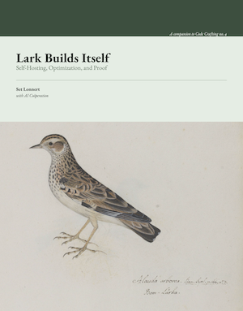

## Lark Builds Itself

> *Lark Builds Itself: Self-Hosting, Optimization, and Proof
> by Set Lonnert, with AI coöperation — a companion to Code Crafting no. 4, The Language 
> Stack (PDF, ~186 pp.)*

This book follows one small purely functional language, Lark, past the point where it
merely works and into the three things a working language can go on to do: build itself, 
make itself faster, and make promises about the programs written in it.

It is organized in three orthogonal parts, each answering a question that stands on its own:
  
  - Part I — A Language That Builds Itself. Lark's reference implementation is rewritten
  from a readable Python "oracle" into Lark itself, until the language is strong enough to
  compile its own construction — self-hosting as a demonstration of expressive power.
  - Part II — The Same Meaning, Faster. An optimizer is added, with every optimized program
  held against the meaning of the un-optimized one — speed at fixed meaning.
  - Part III — What the Machine Can Promise. The type system is extended until it can state
  and check properties of a program's behaviour — this divisor is never zero, this index 
  is in range, this tree stays sorted — and then the same machinery is turned on the
  language itself to prove its soundness.

A single discipline runs through it: every claim in the book is checked by a program you 
can run. The method starts as differential testing against the reference implementation
and, in Part III, turns adversarial — generating hostile programs, running what the
checker claims to have proved, and re-planting every bug ever fixed before trusting the
net again. (Nine false proofs were found this way; none survived.)

The only prerequisite is some programming — comfort with recursion and with the idea that
a program can be data. No compiler theory or logic is assumed; every term is defined
where it first appears. A companion repository provides three self-contained, runnable
trees, one per part.
